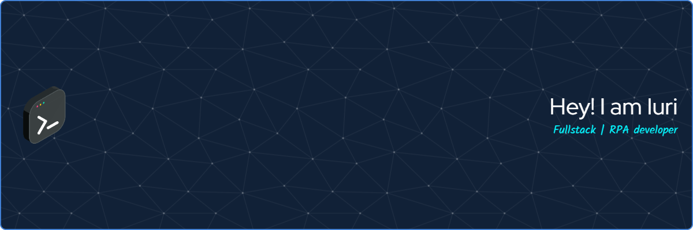

  <a href="https://github.com/iuritorres">
  
  

  
  ##

 
  
  
  
  
  
  
  
  
  
  
  
  
  
  
  

  ##

 
  
  
   

<picture>
  <source media="(prefers-color-scheme: dark)" srcset="https://raw.githubusercontent.com/iuritorres/iuritorres/output/github-contribution-grid-snake-dark.svg">
  <source media="(prefers-color-scheme: light)" srcset="https://raw.githubusercontent.com/iuritorres/iuritorres/output/github-contribution-grid-snake.svg">
  
</picture>

